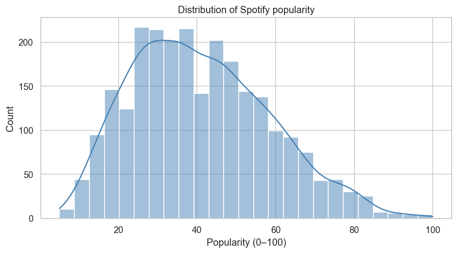
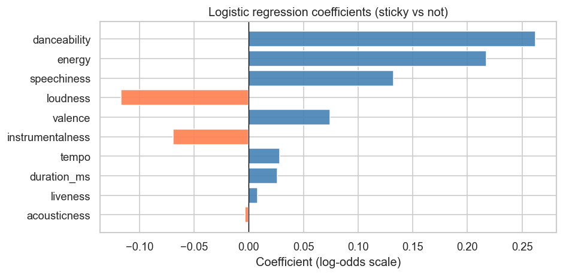
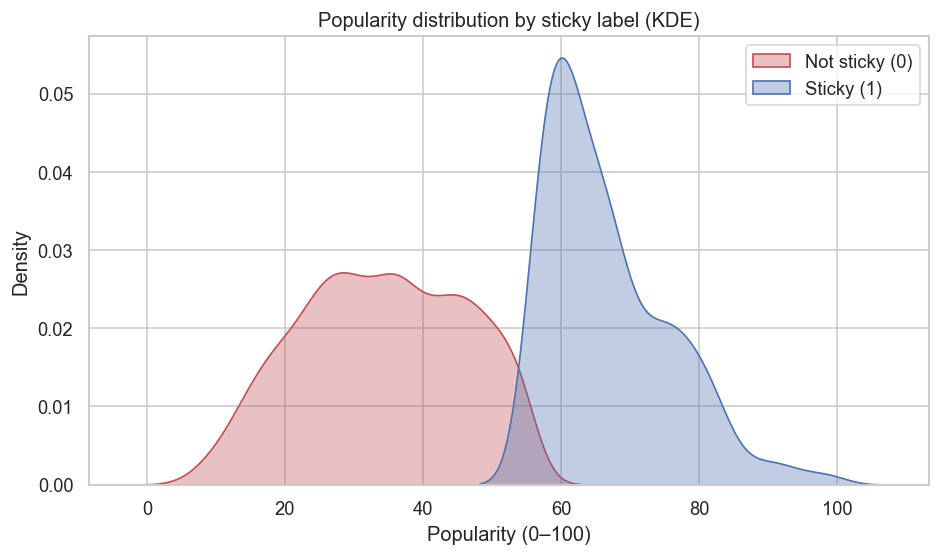
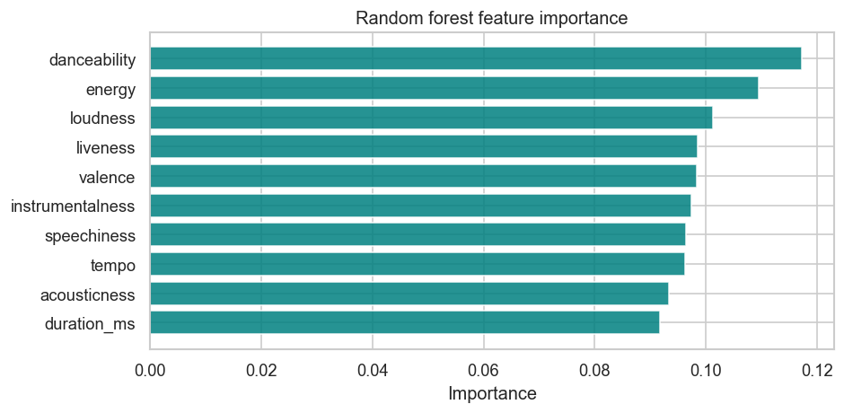
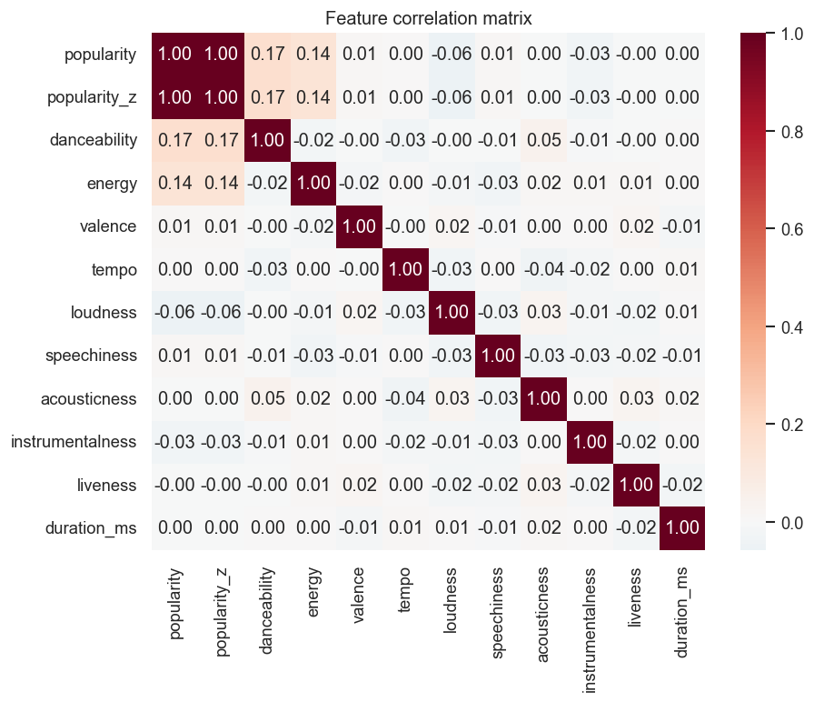
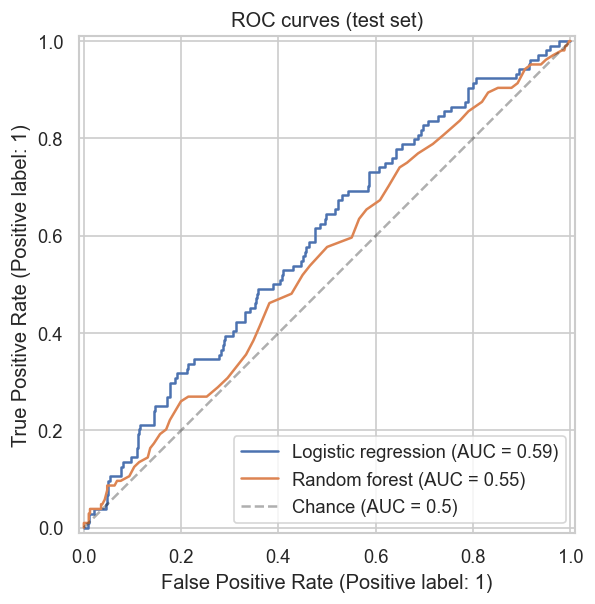
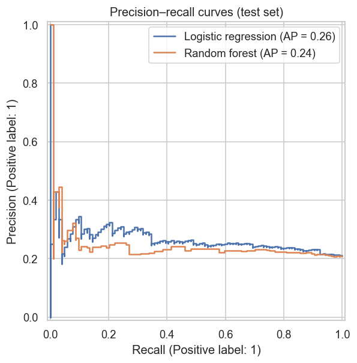

# What Makes a Song Sticky?

**Layout:** This repository is the project root—`README.md`, `notebooks/`, and `src/` sit at the top level so GitHub shows the full README and file tree on the main page.

End-to-end data science project: **which Spotify audio features are associated with highly “sticky” songs** when stickiness is approximated with **public popularity** (not individual replay or skip data).

**Suggested GitHub “About” description:** *Spotify audio features vs popularity proxy — exploratory & predictive analysis (not clinical “addiction”).*

---

## Contents

- [Project Overview](#project-overview)
- [Why This Project](#why-this-project)
- [Research Question](#research-question)
- [Dataset](#dataset)
- [Methodology](#methodology)
- [Repository Structure](#repository-structure)
- [Figure gallery](#figure-gallery)
- [Key Visualizations](#key-visualizations)
- [Main Findings](#main-findings)
- [Product Implications](#product-implications-suggestive)
- [Limitations](#limitations)
- [How to Run](#how-to-run)
- [CI](#ci)
- [Interview Summary](#interview-summary)

---

## Project Overview

Streaming products care whether a song **pulls listeners back**—but public datasets rarely expose repeat listens, skips, or saves. This project studies **audio features** alongside **Spotify popularity** as an **observable proxy** for broad replayability and staying power. The emphasis is on **clear measurement**, **interpretable models**, and **honest limits**—not on claiming literal “addiction” or access to proprietary engagement logs.

---

## Why This Project

Direct **replay, skip, and save** signals are the gold standard for stickiness, yet they are typically **private** and context-specific. **Popularity** is imperfect, but it is **public**, comparable across tracks, and reflects aggregate market attention—making it a defensible **proxy** for an interview-ready portfolio analysis when behavioral logs are unavailable.

---

## Research Question

**Which Spotify audio features are most associated with highly sticky songs, using popularity as a public proxy for replayability?**

---

## Dataset

Place your CSV at `data/raw/spotify_tracks.csv`. The pipeline expects (or maps to) columns such as:

| Area | Columns |
|------|---------|
| Identity | `track_name`, `artist_name`, `genre` (optional) |
| Target proxy | `popularity` (0–100) |
| Audio features | `danceability`, `energy`, `valence`, `tempo`, `loudness`, `speechiness`, `acousticness`, `instrumentalness`, `liveness`, `duration_ms` |

Column names are normalized in code; alternate names are mapped via **`COLUMN_MAP`** in [`src/data_prep.py`](src/data_prep.py) (e.g. `artists` → `artist_name`, `duration` → `duration_ms`).

---

## Methodology

1. **Data cleaning** — Harmonize names, remove duplicates, handle missing values, validate ranges (`01_data_cleaning.ipynb` + `src/data_prep.py`).
2. **Stickiness targets** — `popularity_z` (z-score); binary `sticky` = 1 for tracks at or above the **80th percentile** of popularity (top ~20%).
3. **Exploratory analysis** — Distributions, sticky vs non-sticky comparisons, correlations, optional genre breakdowns (`02_eda.ipynb` + `src/visuals.py`).
4. **Classification** — Logistic regression (standardized features) and random forest; metrics include accuracy, precision, recall, F1, ROC-AUC (`03_modeling.ipynb` + `src/modeling.py`).
5. **Interpretability** — Logistic coefficients and random forest feature importance; optional linear regression / OLS on `popularity_z` for a continuous view.

---

## Repository Structure

```
SongAddiction/                    # repository root (this project)
├── README.md
├── requirements.txt
├── .gitignore
├── scripts/
│   ├── make_demo_data.py           # optional demo CSV if raw data missing
│   └── gh_actions_ci_reference.yml # copy to .github/workflows/ci.yml on GitHub
├── data/
│   ├── raw/
│   │   └── spotify_tracks.csv      # you add this (or run make_demo_data.py)
│   └── processed/
│       ├── spotify_cleaned.csv     # produced by notebook 01
│       └── spotify_model_data.csv
├── notebooks/
│   ├── 01_data_cleaning.ipynb
│   ├── 02_eda.ipynb
│   └── 03_modeling.ipynb
├── src/
│   ├── data_prep.py
│   ├── features.py
│   ├── modeling.py
│   └── visuals.py
├── outputs/
│   ├── figures/
│   └── tables/
└── presentation/
    └── project_summary.md
```

---

## Figure gallery

_Images are written when you run the notebooks; paths are relative to the repo root so they render on GitHub after commit._

| EDA | Modeling |
|-----|----------|
|  |  |
|  |  |
|  |  |
| |  |

---

## Key Visualizations

Produced when you run the notebooks (saved under `outputs/figures/`):

- Popularity histogram  
- **KDE of popularity by sticky label** (overlap of proxy groups)  
- Boxplots of audio features by `sticky`  
- Scatter plots (danceability, energy, duration vs popularity)  
- Correlation heatmap  
- Top 10% vs bottom 10% mean feature comparison  
- Logistic regression coefficient plot  
- Random forest feature importance  
- Confusion matrices  
- **ROC curves** (logistic vs random forest)  
- **Precision–recall curves**  

Optional (if `genre` is present): average popularity by genre, sticky rate by genre, violin plot of a key feature by genre.

---

## Main Findings

_Updated from the last full notebook run (`outputs/tables/model_metrics.csv`, figures in `outputs/figures/`). Re-run `01` → `02` → `03` after replacing `data/raw/spotify_tracks.csv` to refresh._

**Models (hold-out test set, 80/20 stratified split):**

| Model | ROC-AUC | F1 | Notes |
|-------|---------|-----|--------|
| **Logistic regression** | **~0.59** | **~0.33** | `class_weight='balanced'`; better discrimination on the minority (sticky) class. |
| Random forest | ~0.55 | ~0.02 | High accuracy largely reflects majority-class prediction; weak recall on sticky. |

**Takeaway:** For this sample, **logistic regression** is the more useful baseline for **ranking** sticky vs not (ROC-AUC / F1). Performance is **modest** — expected when predicting market popularity from audio alone.

**EDA (linear correlation with popularity):** **Danceability** and **energy** show the clearest positive associations; **valence** is near zero; **duration** is negligible — all **weak** correlations, so conclusions stay tentative.

**Top features (logistic coefficients, direction toward “sticky”):** Among the largest positive drivers in this run are **danceability** and **energy**; **loudness** and **instrumentalness** lean negative (see `outputs/figures/09_logistic_coefficients.png`). Random forest importance is in `10_rf_feature_importance.png` — use alongside coefficients, not as a duplicate story.

---

## Product Implications (Suggestive)

Audio-only signals are **incomplete**, but they can still support product thinking when logs are scarce:

- **Cold-start recommendation** — weak priors for new tracks before behavioral data exists.  
- **Playlist generation / sequencing** — soft constraints alongside collaborative filtering.  
- **Skip-risk estimation** — fallback features when session data is missing (never a replacement for real feedback).  
- **Session-aware recommendation** — combine with context; audio is one slice of the full picture.

---

## Limitations

- **Popularity is not the same as replay rate** — it mixes quality, marketing, artist reach, and timing.  
- **No direct skip/save/replay data** in this public framing.  
- **Correlation is not causation** — associations in one sample do not imply universal rules.  
- **Confounds** — label noise, regional effects, and **genre** metadata quality can distort patterns.

Stating these limits is part of the analysis, not an apology.

---

## How to Run

**Prerequisites:** Python 3.10+ recommended.

```bash
git clone https://github.com/dhruvsood12/SongAddiction.git
cd SongAddiction
python -m venv .venv
source .venv/bin/activate   # Windows: .venv\Scripts\activate
pip install -r requirements.txt
```

1. Place your CSV at `data/raw/spotify_tracks.csv`. If the file is missing, you can generate a small demo dataset: `python scripts/make_demo_data.py`.  
2. Launch Jupyter from this **repository root** (the folder that contains `README.md` and `notebooks/`):  
   `jupyter lab` or `jupyter notebook`  
3. Run notebooks **in order:** `01_data_cleaning.ipynb` → `02_eda.ipynb` → `03_modeling.ipynb`.

Figures write to `outputs/figures/`; the model comparison table writes to `outputs/tables/model_metrics.csv`.

**Headless / CI:** If `plt.show()` crashes (no display), run with a non-interactive backend, e.g. `MPLBACKEND=Agg jupyter nbconvert --execute notebooks/01_data_cleaning.ipynb --inplace` (repeat for `02`, `03`).

---

## CI

The workflow definition lives in **[`scripts/gh_actions_ci_reference.yml`](scripts/gh_actions_ci_reference.yml)** (same content you would put at `.github/workflows/ci.yml`).

It installs dependencies with **pip**, runs `make_demo_data.py`, **executes all three notebooks** with `MPLBACKEND=Agg`, and checks outputs. No Conda.

**Enable Actions on GitHub (pick one):**

1. **Copy-paste (works with any HTTPS token):** In the repo → **Add file** → **Create new file** → path `.github/workflows/ci.yml` → paste from [`scripts/gh_actions_ci_reference.yml`](scripts/gh_actions_ci_reference.yml) → Commit.
2. **Push the file:** Use a PAT with the **`workflow`** scope, or **SSH** remote, then commit `.github/workflows/ci.yml` locally and push.

**If VS Code says “pull before push” but you only added a workflow:** the real error is often **workflow scope** — check the Git / Actions log. Sync with `git pull --rebase origin cleaning-pipeline` before pushing other commits.

**Remove old failing workflows:** Delete any legacy Conda workflow under `.github/workflows/` on GitHub so checks are not duplicated or failing.

---

## Interview Summary

This project asks a **product-relevant question**—what makes tracks **stick** in the wild—using only **public audio + popularity** data. I define **stickiness** transparently as a **top-popularity proxy**, clean and validate the data, explore differences between **sticky vs non-sticky** groups, then fit **interpretable** (logistic) and **nonlinear** (random forest) models. I emphasize **limitations** (popularity confounds, no replay logs) and connect results to **recommendation systems** as **priors and heuristics**, not ground truth. The story is: **rigorous proxy measurement, clear methods, honest interpretation.**
